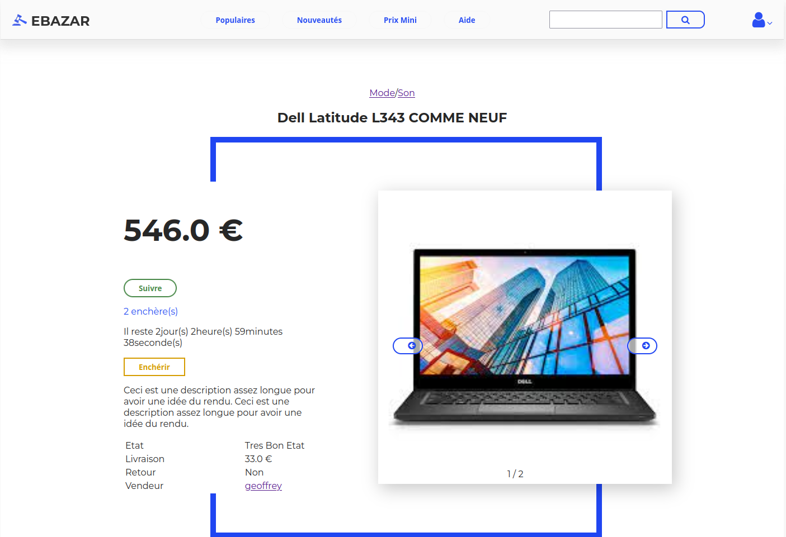
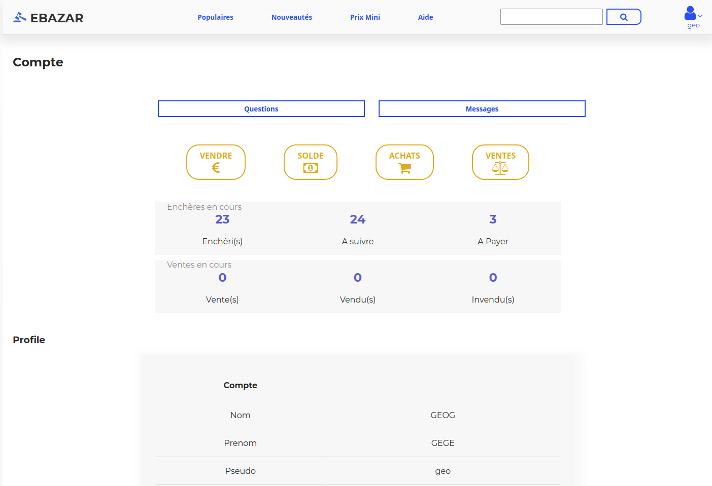

***EBAZAR***

### DEPRECATED 

-----------
*auction site where people can sell and bid on items.*





FRONTEND : 
- React
- Redux
- Sass

BANCKEND : 
- Django
- Rest Framework

***INSTALLATION***
-----------

BACKEND :

- You need Django and Django Rest Framwork
- In manage.py folder, type ```./manage.py runserver```
- In scripts folder, type ```python3 watcher.py```, this script is use to determinate if an item is selled when duration of a bid is over.
- This project use SQlite, you don't need to setup a database to try it

FRONTEND :
- You need React, React router and Redux
- Type ```npm install``` & ```npm start```

